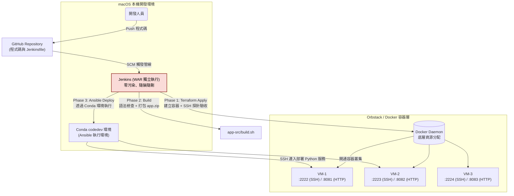
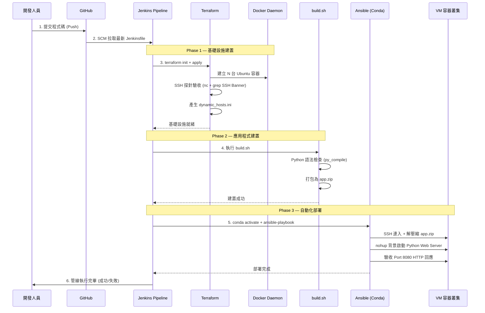

# 基礎建設自動化與 CI/CD 部署流程 (Infrastructure as Code & CI/CD Pipeline)

本專案展示了一個基於 **Jenkins**, **Terraform** 與 **Ansible** 的完整本機 CI/CD 自動化方案。
透過 Jenkins Pipeline 一鍵觸發，即可完成「建置機器 → 打包程式碼 → 自動部署上線」的全流程，所有環節皆以程式碼驅動 (Infrastructure as Code)。

## 模組總覽

本專案設計為由 Jenkins 統一調度，但每個模組也可獨立運作。建議依照以下順序閱讀與操作：

| 順序 | 資料夾 | 使用的工具 | 該做什麼 | 對應文件 |
|------|--------|-----------|---------|----------|
| ① | `jenkins-lab/` | Jenkins (WAR 獨立執行，零污染) | **首次使用**：下載 `jenkins.war` 並啟動 CI/CD 控制中心 | 閱讀 `INSTALL.md` |
| ② | `terraform-lab/` | Terraform (Docker Provider) | **理解基礎設施**：了解如何用程式碼定義容器叢集與 SSH 探針驗收 | 閱讀 `README.md` |
| ③ | `app-src/` | Python 3 (標準函式庫 HTTP Server) | **理解應用程式**：了解零外部依賴的 Web Server 及建置打包流程 | 直接閱讀 `app.py` 與 `build.sh` |
| ④ | `ansible/` | Ansible (Conda `codedev` 環境) | **理解部署流程**：了解如何自動把程式碼派送到容器上 | 閱讀 `README.md` |
| ⑤ | Jenkins 網頁 | — | **一鍵執行**：在 Jenkins 建立 Pipeline 專案並觸發 Build | 參考下方「快速開始」 |

> 容器環境使用 **Docker / Orbstack** 運行 **Ubuntu 22.04** 來模擬目標伺服器。
> 如果只是想快速跑一遍看效果，可以直接跳到「快速開始」章節。

## 專案資料夾結構＆閱讀順序

```text
auto-infra-build/
├── README.md                    # 專案總覽文件 (本文件)
├── .gitignore                   # Git 忽略規則 (含 tfstate、jenkins_data 等)
│
├── jenkins-lab/                 # ① 最先閱讀：CI/CD 控制中心
│   ├── INSTALL.md               # Jenkins 零污染安裝教學 (首次使用請先看這份)
│   ├── README.md                # Jenkins 管線架構說明
│   ├── Jenkinsfile              # Pipeline as Code (一鍵觸發所有階段)
│   ├── jenkins.war              # Jenkins 主程式 (需自行下載，已被 .gitignore 忽略)
│   └── jenkins_data/            # Jenkins 執行資料 (自動產生，已被 .gitignore 忽略)
│
├── terraform-lab/               # ② 第二閱讀：基礎設施定義
│   ├── main.tf                  # 容器叢集定義 + SSH 探針驗收 + 動態 Inventory 產生
│   ├── main.bak                 # 早期版本備份 (參考用)
│   └── README.md                # Terraform 模組說明
│
├── app-src/                     # ③ 第三閱讀：應用程式原始碼
│   ├── app.py                   # 極輕量 Python Web Server (零外部依賴)
│   └── build.sh                 # 建置腳本 (語法檢查 + 打包為 app.zip)
│
└── ansible/                     # ④ 最後閱讀：自動化部署
    ├── demo_setup.yml           # 正式部署腳本 (解壓縮 + 背景啟動 + HTTP 驗收)
    ├── demo_hosts.ini           # 靜態主機清單 (早期範例，已被 dynamic_hosts.ini 取代)
    ├── local_setup.yml          # 早期練習用部署腳本 (參考用)
    ├── index.html               # 早期練習用靜態網頁 (參考用)
    └── README.md                # Ansible 模組說明
```


## 系統架構圖



## 一鍵自動化流程 (Pipeline Architecture)



## 快速開始

### 前置條件
- macOS 環境，已安裝 Java 17+ 與 Docker (或 Orbstack)
- Conda 環境 `codedev` 已安裝 Ansible (`conda activate codedev && ansible --version`)
- 本專案已 Push 至 GitHub (範例：`https://github.com/JeffLin0225/Infra-Provisioning-Flow`)

### Step 1：啟動 Jenkins
```bash
cd jenkins-lab
# 首次使用需先下載 jenkins.war (詳見 INSTALL.md)
JENKINS_HOME=./jenkins_data java -jar jenkins.war
```
啟動後開啟瀏覽器前往 `http://localhost:8080`，完成初始化設定 (詳見 `jenkins-lab/INSTALL.md`)。

### Step 2：在 Jenkins 建立 Pipeline 專案
1. 點選「新增作業 (New Item)」→ 輸入名稱 (例如 `Auto-Pipeline`) → 選擇 **Pipeline** 類型
2. 往下捲到 **Pipeline** 區塊，將 Definition 改為 **Pipeline script from SCM**
3. 填寫以下 SCM 設定：

| 欄位 | 填入值 |
|------|--------|
| SCM | Git |
| Repository URL | `https://github.com/JeffLin0225/Infra-Provisioning-Flow` |
| Branch Specifier | `*/dev` (或您的主要分支名稱) |
| Script Path | `jenkins-lab/Jenkinsfile` |

4. 儲存後點選「Build with Parameters」

### Step 3：選擇參數並執行
| 參數 | 建議值 | 說明 |
|------|--------|------|
| ACTION | `apply` | 建立容器叢集 |
| VM_COUNT | `3` | 開 3 台 VM |
| START_PORT | `2222` | SSH 從 2222 開始 |
| WEB_PORT_START | `8081` | HTTP 從 8081 開始 |
| DEPLOY_TARGET | `web_servers` | 只部署前 2 台 |

按下 **Build** 後等待管線執行完畢。

### Step 4：驗收部署結果
```bash
# 打開瀏覽器
open http://localhost:8081    # → VM-1 的 Python 服務
open http://localhost:8082    # → VM-2 的 Python 服務
```

### 銷毀環境
回到 Jenkins，選擇 `ACTION = destroy` 再執行一次 Build，即可一鍵清除所有容器。
