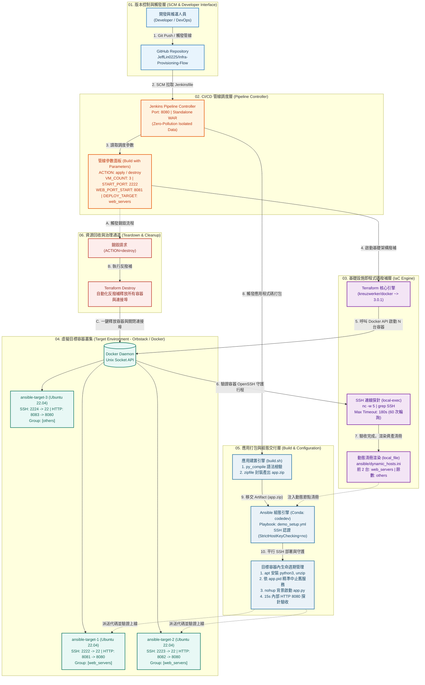

# 基礎建設自動化與 CI/CD 部署流程 (Infrastructure as Code & CI/CD Pipeline)

本專案實作了一套基於 **Jenkins**、**Terraform** 與 **Ansible** 的企業級端到端基礎設施自動化與應用交付流程。藉由 **Pipeline as Code** 設計，透過 Jenkins 參數化單鍵觸發，自動貫穿「虛擬容器叢集撥補（IaC）→ 埠位探針就緒驗收 → 動態資產清冊生成 → 程式碼靜態語法檢驗與封裝 → Ansible 平行派送與行程守護 → HTTP 服務健康驗收」的全自動化流水線，達成基礎架構與應用交付的百分之百程式碼化。

---

## 系統架構



---

## 專案結構

```text
.
├── .gitignore                   # Git 排除清單 (包含 tfstate、動態主機清單、jenkins.war 等)
├── README.md                    # 專案架構說明與維運手冊 (本文件)
│
├── jenkins-lab/                 # 【① CI/CD 調度中樞】
│   ├── INSTALL.md               # Jenkins 本機綠色版 (WAR) 零污染安裝與初始化指南
│   ├── README.md                # Jenkins 模組管線架構與運作邏輯解析
│   ├── Jenkinsfile              # 宣告式流水線腳本 (涵蓋環境檢查、IaC、打包、部署全階段)
│   ├── jenkins.war              # Jenkins 核心可執行檔 (首次執行請依文件手動下載)
│   └── jenkins_data/            # Jenkins 本機執行目錄 (含插件與 Job 狀態，自動生成)
│
├── terraform-lab/               # 【② 基礎設施撥補模組】
│   ├── main.tf                  # HCL 基礎設施定義：容器叢集、SSH 探針驗收、動態清冊渲染
│   ├── main.bak                 # 早期基礎架構設計歷史備份檔
│   └── README.md                # Terraform 模組使用說明與變數設定文件
│
├── app-src/                     # 【③ 輕量 Web 應用原始碼】
│   ├── app.py                   # 原生 Python 3 極輕量 HTTP 伺服器 (包含主機名動態辨識，零依賴)
│   └── build.sh                 # 應用打包腳本 (py_compile 語法檢驗 + 封裝為 app.zip)
│
└── ansible/                     # 【④ 組態管理與自動發布模組】
    ├── demo_setup.yml           # 核心部署 Playbook：環境初始化、解壓、進程清理、背景啟動與探針檢驗
    ├── dynamic_hosts.ini        # 由 Terraform 動態產出之主機清冊 (依 Port 與群組配置)
    ├── demo_hosts.ini           # 靜態主機清單範本 (歷史驗證參考)
    ├── local_setup.yml          # 本機環境部署演練腳本 (參考用)
    ├── index.html               # 靜態首頁範本 (早期測試用)
    └── README.md                # Ansible Playbook 任務流程與分群派送說明
```

---

## 模組總覽與核心職責

本專案採用關注點分離 (Separation of Concerns) 架構，模組可由 Jenkins 集中調度，亦支援工程師手動獨立執行與驗證：

| 順序 | 模組目錄 | 核心技術 | 職責與架構亮點 | 參考文件 |
|:---:|:---|:---|:---|:---|
| ① | `jenkins-lab/` | **Jenkins 2.x** (Pipeline as Code) | **CI/CD 控制中樞**：集中調度各階段任務，透過參數面板控制拓撲規格與發布策略。 | [`INSTALL.md`](file:///Users/jeff/Desktop/change/Infra-Provisioning-Flow/jenkins-lab/INSTALL.md)<br>[`README.md`](file:///Users/jeff/Desktop/change/Infra-Provisioning-Flow/jenkins-lab/README.md) |
| ② | `terraform-lab/` | **Terraform** (Docker Provider) | **IaC 資源撥補**：動態開通多節點 Ubuntu 容器，結合本機 `nc` 探針防範假開機，自動模板化輸出 Inventory。 | [`README.md`](file:///Users/jeff/Desktop/change/Infra-Provisioning-Flow/terraform-lab/README.md) |
| ③ | `app-src/` | **Python 3** (標準函式庫) | **應用建置**：零外部相依微服務，內建 `py_compile` 語法靜態檢查與輕量 ZIP 建置封裝。 | [`build.sh`](file:///Users/jeff/Desktop/change/Infra-Provisioning-Flow/app-src/build.sh) |
| ④ | `ansible/` | **Ansible** (Conda 虛擬環境) | **組態交付**：自動化套件佈署、精準 PID 舊行程汰換、`nohup` 背景生命週期託管與 HTTP 連線驗收。 | [`README.md`](file:///Users/jeff/Desktop/change/Infra-Provisioning-Flow/ansible/README.md) |

---

## 事前準備

### 1. 運行環境與相依工具
- **作業系統**：macOS (Apple Silicon 或 Intel 架構均可)。
- **容器引擎**：Docker Desktop 或 OrbStack (確認 `docker ps` 可正常運作)。
- **Java 環境**：Java 17 或 Java 21 (用於驅動本機獨立 Jenkins WAR)。
- **Terraform**：v1.5.0+。
- **Python / Conda**：安裝 Conda 並建立具備 Ansible 的環境：
  ```bash
  conda create -n codedev python=3.10 -y
  conda activate codedev
  pip install ansible
  ```

---

## 快速開始

### Step 1：啟動本機 Jenkins 控制台
```bash
cd jenkins-lab
# 首次使用需手動下載 jenkins.war (詳見 INSTALL.md)
JENKINS_HOME=./jenkins_data java -jar jenkins.war --httpPort=8080
```
瀏覽器訪問 `http://localhost:8080` 完成管理員帳號初始化。

### Step 2：建立 Pipeline 專案
1. 進入 Jenkins 儀表板 → 點選「新增作業 (New Item)」。
2. 輸入名稱 (例如 `Infra-Provisioning-Flow`)，選擇 **Pipeline** 類型。
3. 在設定頁面捲動至 **Pipeline** 區塊：
   - **Definition**：選擇 `Pipeline script from SCM`。
   - **SCM**：選擇 `Git`。
   - **Repository URL**：`https://github.com/JeffLin0225/Infra-Provisioning-Flow.git`。
   - **Branch Specifier**：`*/main` (或對應的工作分支)。
   - **Script Path**：`jenkins-lab/Jenkinsfile`。
4. 點選儲存後，系統將自動解析出參數面板。

### Step 3：參數化一鍵觸發
點選左側「**Build with Parameters**」，依需求調整參數：

| 參數名稱 | 建議值 | 規格說明 |
|:---|:---:|:---|
| `ACTION` | `apply` | 選擇 `apply` 進行開機與部署；選擇 `destroy` 進行環境清空 |
| `VM_COUNT` | `3` | 虛擬目標主機 (容器) 開通總數量 |
| `START_PORT` | `2222` | SSH 映射本機的起始連接埠 (遞增分配：2222, 2223, 2224...) |
| `WEB_PORT_START` | `8081` | Web 服務對外暴露之起始連接埠 (遞增分配：8081, 8082, 8083...) |
| `DEPLOY_TARGET` | `web_servers` | Ansible 部署目標群組：`web_servers` (前2台)、`others` (第3台起)、`all`、`none` (純開機不發布) |

按下 **Build**，管線即會自動執行全流程。

---

## 驗收與維運指令

### 1. HTTP 服務端點驗證
管線執行完畢後，開啟終端機或瀏覽器檢驗部署節點回應：
```bash
# 驗證節點 1 (web_servers)
curl -s http://localhost:8081 | grep "CI/CD 自動化部署成功"

# 驗證節點 2 (web_servers)
curl -s http://localhost:8082 | grep "CI/CD 自動化部署成功"

# 驗證節點 3 (others，未在 web_servers 群組故應無服務監聽)
curl -I http://localhost:8083
```

### 2. SSH 容器穿透手動除錯
如需進入容器檢查日誌或行程狀態，可直接透過對外 Port 連入：
```bash
# 登入 VM-1 (密碼: root)
ssh -p 2222 root@localhost -o StrictHostKeyChecking=no

# 於容器內部檢查行程與日誌
ps aux | grep app.py
cat /opt/auto-infra-app/app.log
cat /opt/auto-infra-app/app.pid
```

### 3. 一鍵銷毀環境 (Teardown)
當完成驗證或需重設環境時：
1. 回到 Jenkins 介面點選 **Build with Parameters**。
2. 將 `ACTION` 改選為 `destroy` 並執行。
3. 管線將調用 `terraform destroy -auto-approve`，毫秒級釋放所有容器資源與連接埠佔用。
