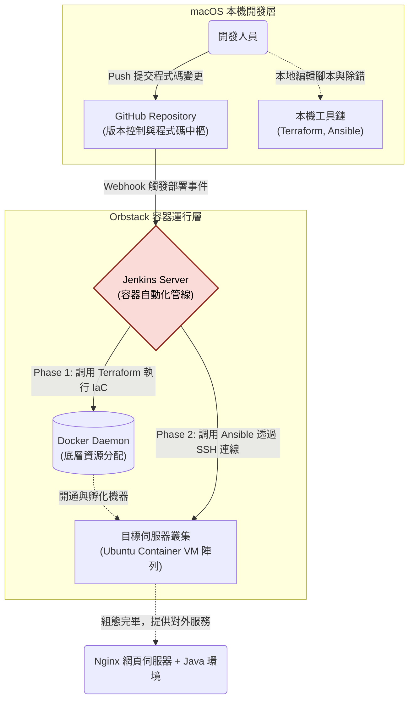
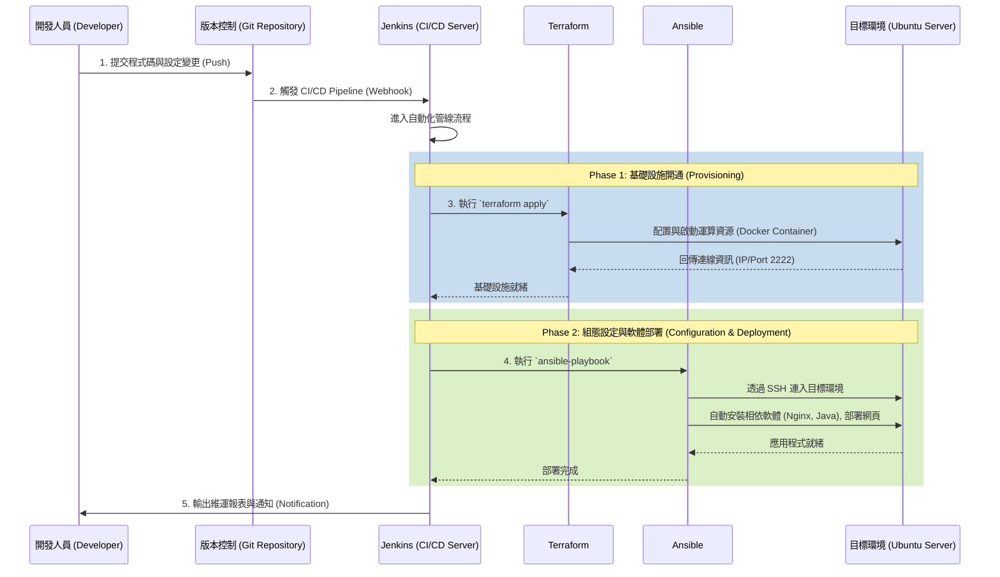

# 基礎建設自動化與 CI/CD 部署流程 (Infrastructure as Code & CI/CD Pipeline)

本專案展示了一個基於 **Jenkins**, **Terraform** 與 **Ansible** 的全自動化基礎建設與持續整合/持續部署 (CI/CD) 解決方案。透過將基礎架構腳本化 (IaC) 以及組態管理自動化，實現從開發端提交程式碼到伺服器資源開通、應用軟體部署的一鍵式工作流。

## 架構概覽與系統角色

本系統由三個核心元件組成，各自負責自動化生命週期的不同階段：

1. **Jenkins (CI/CD 自動化管線 控制中心)**：
   作為自動化排程的核心，負責監聽版本控制系統 (如 Git) 的變更。當偵測到更新時，觸發自動化管線 (Pipeline)，依序指揮後續的資源建置與組態配置任務。

2. **Terraform (基礎建設即程式碼 IaC)**：
   負責下層運算資源的管理與開通。本專案透過 Terraform 與 Docker Provider (本地 Orbstack 環境) 互動，動態配置出具備 SSH 連線能力的 Ubuntu 目標伺服器容器。

3. **Ansible (組態管理與自動化部署)**：
   負責伺服器內部的組態設定。在伺服器（容器）開通後，Ansible 會透過 SSH 自動連入目標機器，並依照 Playbook 定義的流程安裝系統軟體 (Nginx, Java) 與部署前端應用程式 (`index.html`)。

## 總體系統邏輯架構圖 (System Architecture)

本專案建構於單機開發環境中，精確劃分了「本機開發層」與「容器運行層」的邊界。以下架構圖展示了 macOS 本機工具、存放原始碼的 GitHub，以及運作在 Orbstack 引擎上的容器（Jenkins 與 Target VM）之間是如何連動配合的：



## 專案資料夾結構

```text
auto-infra-build/
├── README.md               # 專案總覽文件 (本文件)
├── jenkins-lab/
│   └── README.md           # Jenkins 管線流程說明與架構
├── terraform-lab/
│   ├── main.tf             # Terraform IaC 啟動目標伺服器之定義檔
│   └── README.md           # Terraform 資源配置說明與架構
└── ansible/
    ├── gcp_setup.yml       # Ansible 組態腳本 (安裝 Nginx, Java 及部署網頁)
    ├── index.html          # Web 前端應用檔案
    └── README.md           # Ansible 部署流程說明與架構
```

## 端到端自動化運作流程 (Pipeline Architecture)

以下流程圖說明當有新程式碼提交時，這三套系統如何協同完成從環境建置到服務上線的完整自動化流程：


