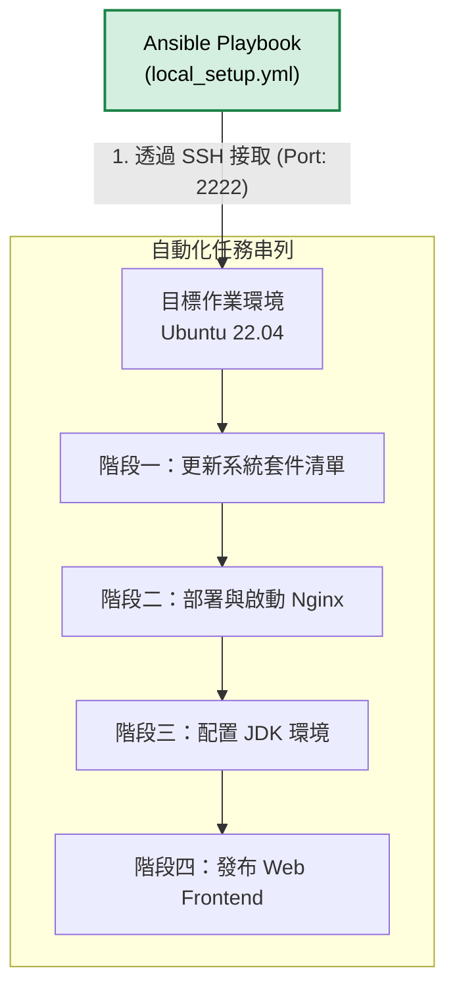

 # Ansible 組態管理與自動部署模組 (Configuration & Deployment)

## 模組簡介
本模組負責接手已完成開通之運算資源（由 Terraform 提供），並進行伺服器內部的環境初始化、依賴軟體安裝以及應用程式邏輯的部署。Ansible 提供了一致性且可重複執行的組態管理 (Configuration Management) 機制，確保不同環境間的設置達到統一。

## 部署腳本說明 (`local_setup.yml`)
本腳本針對目標環境 (Ubuntu) 執行系統準備與應用發布，其設計相容於任何提供 SSH 接取的標準 Linux 伺服器實體或容器。

主要的 Playbook 執行階段包含：
1. **系統套件更新**：執行 `apt update` 確保系統處於最新的官方套件庫來源狀態。
2. **基底伺服器安裝**：
   - 安裝 Nginx 網頁伺服器並將其設置為系統服務，確保能在開機時自動啟動。
   - 安裝 Java (default-jdk)，為潛在的後端服務存取提供執行環境，並驗證安裝結果。
3. **應用程式發布**：
   - 部署靜態前端檔案，將本專案內的 `index.html` 同步並覆寫至伺服器的 `/var/www/html/` 預設工作目錄。
   - 配置適當的檔案權限 (`0644`) 與擁有者群組 (`www-data`)，以符合 Nginx 伺服器的安全讀取標準。

## 模組內部運作架構

