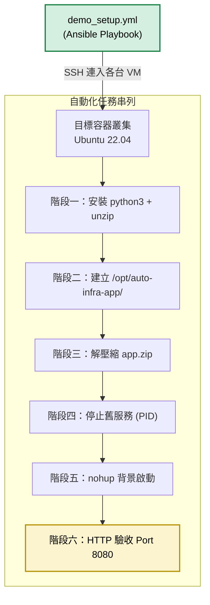

# Ansible 組態管理與自動部署模組 (Configuration & Deployment)

## 模組簡介

本模組負責接手 Terraform 已開通的容器叢集，透過 SSH 連入目標容器，自動完成應用程式的部署與啟動。
部署的應用程式為 `app-src/app.py`，一支零外部依賴的 Python HTTP Server，由 Jenkins 的 Build 階段打包為 `app.zip` 後交由本模組派送。

## 部署腳本說明 (`demo_setup.yml`)

本 Playbook 會透過 SSH 連入目標容器，依序執行以下階段：

| 階段 | 任務 | 說明 |
|------|------|------|
| 1 | 安裝基礎套件 | 確保 `python3` 與 `unzip` 存在 (冪等性：已安裝則跳過) |
| 2 | 建立應用目錄 | 在 `/opt/auto-infra-app/` 建立專屬資料夾 |
| 3 | 解壓縮部署 | 將 Jenkins 建置階段產出的 `app.zip` 傳送至容器並解壓 |
| 4 | 停止舊服務 | 透過 PID 檔案精準終止舊程序 (避免誤殺 Ansible 自身連線) |
| 5 | 背景啟動新服務 | 使用 `nohup` 在 Port 8080 啟動 Python Web Server |
| 6 | 驗收服務回應 | 實際發出 HTTP 請求確認 Port 8080 正常回應 |

## 主機清單 (Inventory)

本模組使用 **動態產生** 的 `dynamic_hosts.ini`，不需要手動維護。

### 動態產生機制

在 `terraform-lab/main.tf` 中，我們透過 `local_file` 資源搭配 Terraform 的 `count` 迴圈機制，讓 Terraform 在建立容器的同時自動產出這份清單：

- Terraform 根據 `container_count` 變數決定要開幾台容器
- 每台容器的 SSH Port 會從 `start_port` 開始遞增 (2222, 2223, 2224...)
- 前 2 台自動歸類為 `[web_servers]`，第 3 台起歸類為 `[others]`
- 每台使用獨立別名 (`vm-1`, `vm-2`...)，避免 Ansible 對同名主機去重複

產出的格式範例 (以 `container_count=3`, `start_port=2222` 為例)：
```ini
[web_servers]
vm-1 ansible_host=localhost ansible_port=2222
vm-2 ansible_host=localhost ansible_port=2223

[others]
vm-3 ansible_host=localhost ansible_port=2224

[all:vars]
ansible_user=root
ansible_ssh_pass=root
ansible_ssh_common_args='-o StrictHostKeyChecking=no -o UserKnownHostsFile=/dev/null'
```

> `demo_hosts.ini` 為早期的靜態範例檔案，供參考但不再使用於管線中。

## 模組內部運作架構


