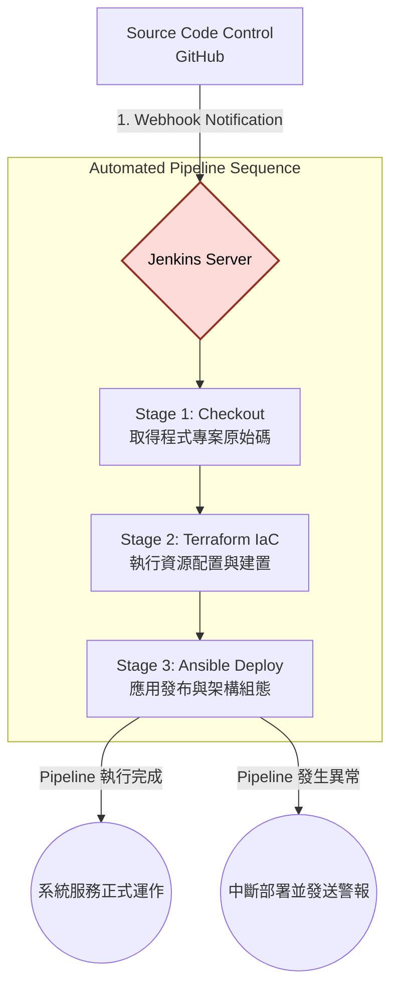

# Jenkins 核心整合管線 (CI/CD Pipeline System)

## 模組簡介
這個模組定位為整個專案的整合與排程中樞。Jenkins 負責統籌軟體交付生命週期 (Software Delivery Life Cycle)，將程式碼的變更事件，與基層的環境管理 (Terraform) 以及上層的軟體發布 (Ansible) 無縫整合，形成連續且無需人工干預的自動化管線 (Pipeline)。

## 管線設計與執行階段 (Pipeline Stages)
本專案的 CI/CD 管線設計理念是使用 Pipeline as Code，當版本控制庫發生更新時，會自動依序啟動並監控下列階段：

1. **Source Tracking (變更追蹤與代碼取得)**：
   管線自動偵測 GitHub 的變更事件 (透過 Webhook)，並將最新版本的架構專案拉取至 Jenkins 的實體工作區 (Workspace)。
2. **Infrastructure Validation & Provision (基礎設施檢查與建置)**：
   將執行環境切換至 `terraform-lab/` 目錄，經由 `terraform init` 與 `terraform apply` 系列動作，動態檢查運算資源的一致性，確保伺服器與網路介面配置符合期待並處於就緒狀態。
3. **Continuous Deployment (環境組態與持續部署)**：
   將執行環境切換至 `ansible/` 目錄，依據最新目標環境的動態地址，執行 `ansible-playbook` 進行應用程式的安裝、系統層環境變更及中介軟體的啟動設定。

## 模組內部運作架構

