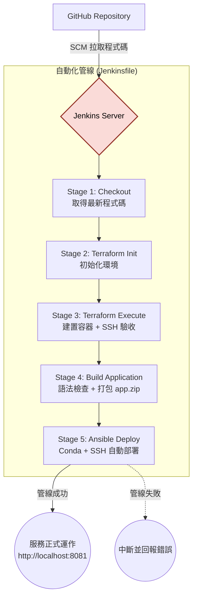

# Jenkins 核心整合管線 (CI/CD Pipeline System)

## 模組簡介

本模組是整個專案的調度中樞。Jenkins 負責統籌軟體交付的完整生命週期，將程式碼變更事件與基礎建設 (Terraform)、應用建置 (build.sh)、自動部署 (Ansible) 無縫串接，形成一鍵觸發的自動化管線。

## 管線設計與執行階段

本專案採用 **Pipeline as Code** 模式，`Jenkinsfile` 定義了以下 5 個階段：

| 階段 | 名稱 | 說明 |
|------|------|------|
| 1 | Checkout Code | 從 GitHub SCM 拉取最新程式碼到 Jenkins 工作區 |
| 2 | Terraform Init | 初始化 Terraform 環境 (下載 Docker Provider) |
| 3 | Terraform Execute | 建立或銷毀容器叢集，並產生動態 Inventory |
| 4 | Build Application | 對 `app-src/app.py` 執行語法檢查並打包為 `app.zip` |
| 5 | Ansible Deploy | 啟動 Conda 環境，透過 Ansible 將 app.zip 部署到目標容器 |

> 階段 4 和 5 只在 `ACTION=apply` 且 `DEPLOY_TARGET≠none` 時才會執行。

## 參數面板

使用者在 Jenkins 網頁點選「Build with Parameters」時，可以設定以下參數：

| 參數 | 類型 | 預設值 | 說明 |
|------|------|--------|------|
| ACTION | 下拉選單 | apply | 建立 (apply) 或銷毀 (destroy) 機器 |
| VM_COUNT | 文字輸入 | 3 | 要建立幾台 VM |
| START_PORT | 文字輸入 | 2222 | SSH 起始 Port |
| WEB_PORT_START | 文字輸入 | 8081 | HTTP 起始 Port |
| DEPLOY_TARGET | 下拉選單 | web_servers | Ansible 部署目標群組 |

## 模組內部運作架構

