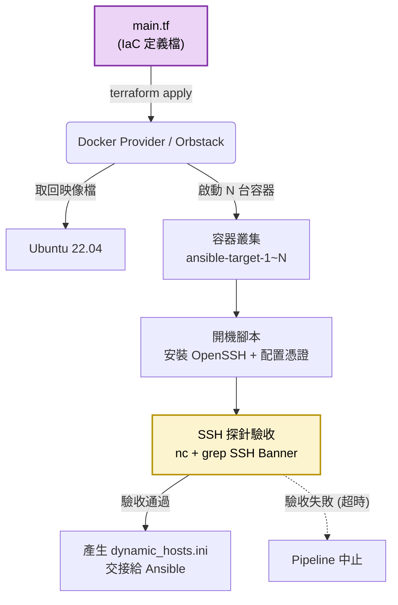

# Terraform 資源配置模組 (Infrastructure Provisioning)

## 模組簡介

本模組負責專案底層運算資源的配置與建置，實踐 **基礎架構即程式碼 (Infrastructure as Code, IaC)** 的理念。
採用 macOS 環境下的 **Docker Provider (搭配 Orbstack)** 作為資源供應商，模擬在雲端 (AWS/GCP) 開通虛擬機的行為。

## 設定檔說明 (`main.tf`)

`main.tf` 定義了本專案所需的運算環境，主要包含以下區塊：

### 變數宣告 (Parameters)
| 變數名稱 | 預設值 | 說明 | 用途 |
|----------|--------|------|------|
| `container_count` | 3 | 建立容器的數量，可由 Jenkins 動態傳入 | 決定開幾台 VM |
| `start_port` | 2222 | SSH 對外映射的起始 Port (2222/2223/2224) | 供 Ansible 透過 SSH 連入容器進行自動化部署 |
| `web_port_start` | 8081 | HTTP 對外映射的起始 Port (8081/8082/8083) | 供瀏覽器存取容器內部署的 Python Web 服務 |

### 容器叢集建立
- 使用官方 Ubuntu 22.04 映像檔。
- 透過 Entrypoint 開機腳本安裝 SSH 伺服器並設置管理憑證。
- 每台容器同時映射 SSH (Port 22) 與 HTTP (Port 8080) 兩個通道。

### SSH 探針驗收機制
- 使用 `provisioner "local-exec"` 在建立完成後，持續偵測 SSH Banner 是否就緒。
- 只有 SSH 真正啟動回應後，Terraform 才會宣告資源完成，避免後續 Ansible 連線失敗。

### 動態 Ansible Inventory 產生
- 透過 `local_file` 資源搭配 `count` 迴圈，自動依據容器數量產生 `ansible/dynamic_hosts.ini`。
- 前 2 台歸類為 `[web_servers]`，其餘歸類為 `[others]`，供 Ansible 選擇性部署。

## 模組內部運作架構

