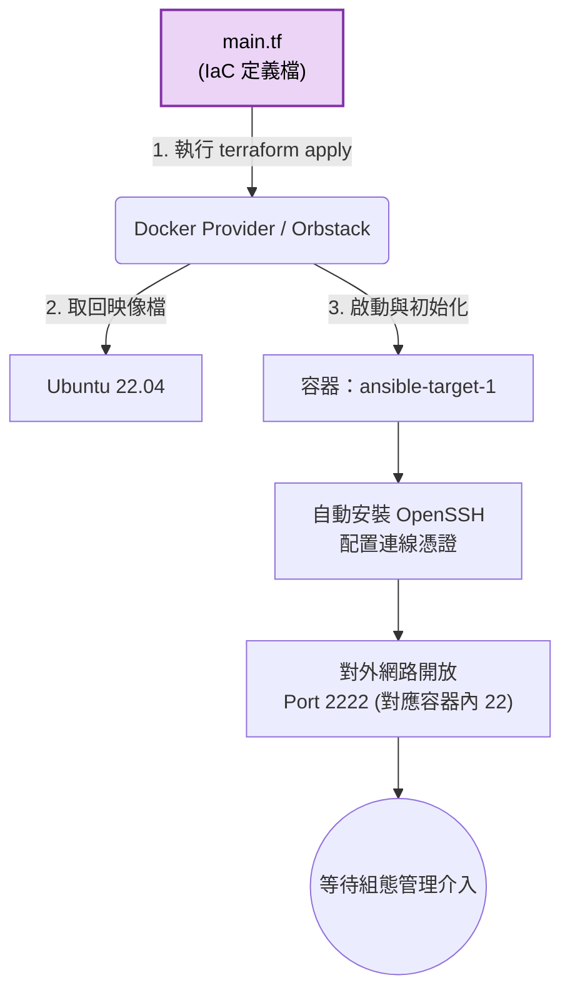

# Terraform 資源配置模組 (Infrastructure Provisioning)

## 模組簡介
本模組負責專案底層運算資源的配置與建置，實踐**基礎架構即程式碼 (Infrastructure as Code, IaC)** 的理念。

為了便於本機端開發與測試，目前的設計採用了 macOS 環境下的 **Docker Provider (搭配 Orbstack)** 作為資源供應商，藉以模擬實際在雲端 (如 AWS/GCP) 開通虛擬機器 (VM) 的行為。

## 設定檔說明 (`main.tf`)
`main.tf` 定義了本專案所需的運算環境，其主要工作流程包含：
1. **Provider 宣告**：引入 Docker Provider，設定 Terraform 與 Docker Daemon 的互動介面。
2. **作業系統映像檔**：定義使用官方 Ubuntu 22.04 映像檔作為系統基底。
3. **資源啟動與初始化**：
   - 啟動名為 `ansible-target-1` 的容器資源。
   - 透過 Entrypoint 進行系統初始化，包含更新套件清單、安裝及啟動 SSH Server (OpenSSH)，並設置預設的管理權限憑證。
   - 配置網路埠口對應，將目標環境內的 22 (SSH) Port 映射至宿主機的 2222 Port，以供後續的組態管理工具 (Ansible) 連線存取。

## 模組內部運作架構

